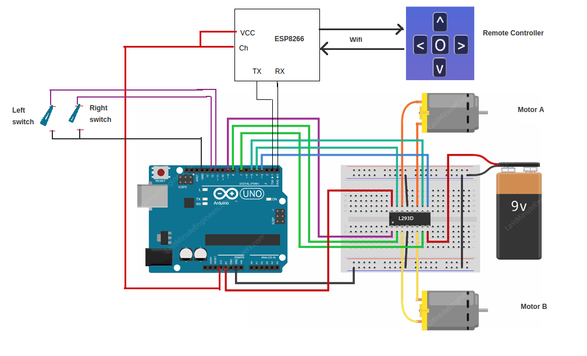
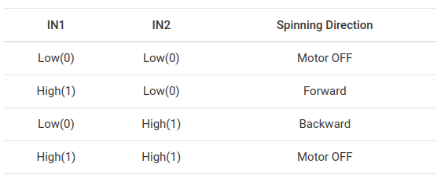
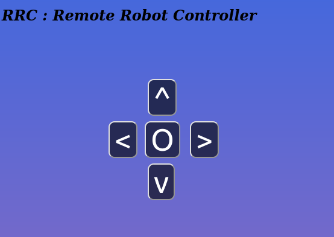

# Obstacle Avoidance robot
The task is to build a software for a simple remote control robot with obstacle avoidance. The hardware includes ESP8266, Arduino Uno, two momentary switches. The robot can be controlled by remote client in the same network.

## To Do List
- [x] Circuit diagram of motors and sensors with UNO
- [x] Pin diagram with ESP8266
- [x] Code to control Motor driver with UNO
- [x] Autonomy node with adruino
- [x] JS to send ESP8266
- [] Documentation

## Hardware Setup

### System Architecture
A remote client controls the robot by sending the commands to the arduino MCU via the ESP8266 wifi module. The MCU in turn sends a PWM signals to the motor based on the manuever decided. The momentary switches indicate the presence of obstacles and trigger a manuever change over riding the commands sent by the remote controller. 

### Arduino UNO
Arduino UNO is used to configure the ESP8266 module via serial inputs. The RX, TX pins are connected and later configured using the SoftwareSerial library. The motor driver L293D is configured and controlled to execute the action. 
The internal pull up resistors are useful in detecting the state of the momentary switches. When the switches are triggered, it connects to the ground and provides a LOW state with the help of pull down resistors. 

### ESP8266 setup
The ESP8266 communicates with the Arduino through Serial Communication. AT commands are used to activate and enable wireless communication. A static IP of our choice is set up for the wifi module. 
The required update frequency > 10Hz is set by adjusting the baud rate of the serial communication in the code. 

### Motor drive (L293D)
Each motor is controlled by 2 control pins (IN) and a PWM pin (ENA). The two control pins decide the direction of current flow, ie the direction of motor shaft rotation. Pins with PWM capability, 3 and 10 are used to adjust the speed of the motors.

Chart of different logic states is provided below

## Web Interface
A HTML Client is used to control the robot remotely. Adruino UNO is recieves the command through the network using the ESP8266 module. The HTML client uses a JS backend to transmit the directional command to a static IP corresponding to the ESP8266. To view the Robot Remote Controller, open the teleop.html file in a web browser. 

The wifi SSID and the corresponding password has to be entered to enable ESP8266 to connect with the network.
 

## Dependencies
Arduino 1.6.1  
ESP8266 Arduino Core 2.7.4

